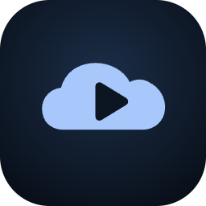

# WebDavPlayer 🎵

<p align="center">
  
</p>

<p align="center">
  <strong>专为远程私有云（NAS / 网盘）打造的现代化 Android WebDAV 高保真流式音频播放器</strong>
</p>

<p align="center">
  <a href="https://developer.android.com/about/versions/10"></a>
  <a href="https://kotlinlang.org/"></a>
  <a href="https://isocpp.org/"></a>
  <a href="https://developer.android.com/jetpack/compose"></a>
  <a href="https://developer.android.com/guide/topics/media/media3"></a>
  <a href="LICENSE"></a>
</p>

---

## 📖 项目简介

**WebDavPlayer** 是一款遵循 **Material Design 3 (Material You)** 现代设计语言的 Android 原生流式音频播放器。

通过标准的 WebDAV (HTTP/HTTPS) 协议，用户能够直接挂载并流式回放家庭 NAS（群晖 Synology、威联通 QNAP、TrueNAS）、路由器私有云盘或各类远程服务器上的高保真音乐资产。项目基于 **AndroidX Media3 (ExoPlayer)** 并深度集成 **FFmpeg 原生 C++ JNI 解码扩展**，提供毫秒级在线即点即播体验，无需同步下载曲目到本地永久存储，畅享轻量纯粹的云端音乐。

---

## ✨ 核心特性

### 🚀 1. 纯流式零磁盘占用回放（Pure Online Streaming）
- **按需分块流式缓冲**：基于 HTTP/HTTPS Range 分块按需拉取音频数据，毫秒级起播。
- **流式解包与精准定位**：采用面向网络流的单向消费管道，结合动态 Range 重寻址与 Native 状态机对齐，实现长音频与大文件的平滑拖拽即时发声。
- **零持久化磁盘开销**：回放数据仅在内存及有限临时缓冲区流动，播放结束即刻释放，绝不永久占用宝贵手机存储。
- **智能音频焦点协商（Audio Focus）**：无缝响应通话打断、系统通知压低（Ducking）与蓝牙断开自动暂停。

### 🎼 2. 全格式硬核音频解码（FFmpeg Native Extension）
- **原生双引擎驱动**：采用 Android 官方推荐的 `androidx.media3` 解码流水线，结合自定义 **FFmpeg JNI (C++17)** 原生扩展。
- **全格式兼容**：
  - **主流格式**：MP3, AAC, OGG, OPUS, WAV。
  - **高保真无损格式**：FLAC (高达 24-bit / 192kHz)。
  - **传统发烧友特有格式**：原生系统无法解码的 **WMA / ASF**（配备自研高性能流式 Demuxer 与时间戳对齐软解）、**APE (Monkey's Audio)**。
- **视觉音质胶囊徽标**：曲目列表与大播放器实时呈现专属格式与音频规格徽标（如 Hi-Res、FLAC、WMA、WAV）。

### ⚡ 3. 毫秒级两阶段增量元数据提取（On-demand Range Extraction）
- **自适应 512KB 分片拉取**：拒绝整首曲目下载，仅发起轻量 HTTP Range 请求探测音频文件头尾关键字节块。
- **毫秒级全格式标签解析**：自研轻量解析流水线，覆盖 ID3v1, ID3v2 (v2.2/v2.3/v2.4), VorbisComment, ASF/WMA 格式，瞬时解析曲目标题、艺术家、专辑、时长及内嵌高清封面。
- **双源封面回退机制（Dual-Source Artwork Pipeline）**：优先提取音频内嵌高清封面；若音频无内嵌图，自动在同目录下发起单次轻量受限探测，检索同名封面（`${basename}.jpg`/`.png`）或目录封面（`cover.jpg`、`folder.jpg`），本地压缩缓存为缩略图。
- **自愈式元数据仓储（Self-Healing Metadata Cache）**：由 `TrackMetadataRepository` 统一内化缩略图存活性校验，即便本地缓存被外部清理，仓储层也能自动并发自愈修复，向会话层与 UI 屏蔽底层故障。

### 📜 4. 工业级歌词规整与双语时间对齐（Bilingual LRC Engine）
- **双源歌词发现**：自动检索远程同目录同名 `.lrc` 文件，无外置文件时无缝降级读取音频内嵌歌词（USLT / VorbisComment）。
- **工业级时间戳清洗与近邻去重**：严格保留副歌跨段落展开（Repeated Chorus），彻底清洗行内词级卡拉OK时间戳（Enhanced LRC），消除同一歌词上下行堆叠显示的行业痛点。
- **主译双语平行排版**：自动将相同或微小时间差（<300ms）的主歌词与译文智能归并为单一时间节点，逐行平滑滚动并支持点击精确 Seek 跳转。

### 💾 5. SWR 目录缓存与全状态冷启动恢复（Stale-While-Revalidate）
- **秒级目录快照呈现**：基于 **Room** 数据库对 WebDAV 目录树进行结构化镜像缓存，进入目录瞬间立即可见，断网/弱网下依然可浏览。
- **后台静默增量同步**：在呈现缓存的同时后台静默发起 WebDAV PROPFIND 同步，智能合并远程文件变更。
- **双重状态恢复（Session Resume）**：
  - **播放会话快照**：退出后持久化保留活跃服务器、当前播放队列、当前音轨索引与毫秒级进度，冷启动无缝续播。
  - **服务器浏览路径记忆**：为每一个 WebDAV 服务器独立记录离开时的最后停留目录路径，切换服务器或重启应用直接定位。

### 🛡️ 6. 健壮的后台服务与安全认证体系
- **首帧同步前台服务提升（First-Frame Service Elevation）**：在 `WebDavMediaService` 创建的首帧生命周期内立即同步提升前台并展示通知，彻底解耦异步网络握手状态，根除 Android 8.0+ 系统的 5 秒超时崩溃（`RemoteServiceException`）。
- **动态凭据化媒体源（Dynamic Authenticated MediaSource）**：ExoPlayer 底层数据源动态直连 `Server Context`，无论播放切歌、网络恢复重试还是后台异步元数据加载，自动携带 Basic/Digest 鉴权头与 SSL 配置，告别 HTTP 401 裸请求。
- **在途元数据无感富化（Non-Disruptive Metadata Enrichment）**：后台解析出高清封面和标签后，仅广播更新应用会话流与系统锁屏 `MediaSession`，严禁推倒重建播放器时间线，确保流式回放无卡顿、无杂音。
- **自签名 SSL 证书信任**：支持自签名证书一键信任，无障碍对接各类局域网私有云与家庭 NAS。

### 🎨 7. 原生 Material Design 3 (Material You) 视觉规范
- **沉浸式边到边体系（Edge-to-Edge Chrome）**：界面完整铺满至系统状态栏与手势导航条后方，随封面色调自适应微调明暗反差。
- **自适应应用图标（Adaptive Themed Icon）**：根据 MD3 大连续超椭圆（Squircle）重新设计的极简流体云与圆角播放键，深度适配 Android 13+ 壁纸动态提取变色（Themed Icons）。
- **全局驻留悬浮 Mini-Player 胶囊**：在页面切换与层级钻取时始终浮动驻留，提供核心播控与平滑展开入口。
- **全屏大播放器视图（Full Player Sheet）**：自适应提取封面色彩生成柔和氛围光晕渐变背景，集成黑胶旋转律动，轻量滑动手势收起，左右滑动无缝切换至双语歌词大视窗。
- **水平滑动自适应面包屑（Directory Breadcrumb Strip）**：MD3 胶囊 Chip 路径条，支持任意祖先层级瞬时穿梭回跳。
- **跳动音浪状态指示器（Equalizer Track Indicator）**：目录浏览时即时呈现当前正在播放的曲目动态三柱等化器跳动脉冲。

---

## 🏗️ 架构设计与代码组织

本项目严格践行 **整洁架构（Clean Architecture）** 与 **单向数据流（UDF, Unidirectional Data Flow）** 原则：

```text
app/src/main/
├── cpp/                                     # FFmpeg 原生解码层 (C++17 / CMake)
│   ├── ffmpeg_demuxer.cc                    # WMA (ASF) / APE 等格式的原生解复用器
│   └── ffmpeg_jni.cc                        # JNI 接口跨语言桥接
│
├── java/com/webdav/player/
│   ├── data/
│   │   ├── local/                           # 本地持久层 (Room / DataStore)
│   │   │   ├── AppDatabase.kt               # Room 核心数据库定义
│   │   │   ├── CoverArtStorage.kt           # 本地封面缩略图磁盘压制与存活性校验
│   │   │   ├── DirectoryCacheDao.kt         # SWR 目录缓存数据访问接口
│   │   │   ├── TrackMetadataDao.kt          # 音频元数据本地索引访问接口
│   │   │   └── WebDavServerDao.kt           # WebDAV 服务器配置仓储持久化
│   │   ├── lyrics/
│   │   │   └── LrcParser.kt                 # 工业级 LRC 解析器（清洗行内词标签与双语归并）
│   │   ├── metadata/                        # HTTP Range 增量音频标签解析适配器
│   │   │   ├── Id3v2Parser.kt               # ID3v2 标签解析（MP3 等）
│   │   │   ├── FlacParser.kt                # VorbisComment 解析（FLAC / OGG）
│   │   │   ├── WavParser.kt                 # RIFF/INFO/ID3 解析（WAV）
│   │   │   ├── AsfParser.kt                 # ASF 标头解析（WMA 等）
│   │   │   └── DefaultTrackMetadataResolver.kt # 内部两阶段 Range 提取与双源封面探测器
│   │   ├── player/                          # 媒体引擎适配与流媒体数据源
│   │   │   ├── Media3AudioPlayerEngine.kt   # AndroidX Media3 (ExoPlayer) 核心实现
│   │   │   ├── WebDavDataSourceFactory.kt   # 动态凭据注入的 OkHttp 数据源工厂
│   │   │   ├── WebDavMediaSourceAdapter.kt  # 服务上下文自适应媒体源构建器
│   │   │   └── AudioFocusHandler.kt         # 系统音频焦点监听与自动暂挂恢复
│   │   ├── remote/                          # WebDAV 网络协议客户端
│   │   │   ├── OkHttpWebDavClient.kt        # 基于 OkHttp 的 WebDAV PROPFIND / 请求执行器
│   │   │   └── WebDavXmlParser.kt           # 高性能 XML 解析远程多状态响应 (Multistatus)
│   │   ├── repository/                      # 领域仓储契约的具体实现
│   │   │   ├── DirectoryRepositoryImpl.kt   # SWR 目录缓存与远程拉取协调仓储
│   │   │   ├── TrackMetadataRepositoryImpl.kt # 自愈式元数据与双源封面缓存仓储
│   │   │   ├── LyricsRepositoryImpl.kt      # 双源歌词检索与规范化仓储
│   │   │   └── ServerRepositoryImpl.kt      # WebDAV 服务器配置响应式仓储
│   │   └── service/                         # Android 系统前台媒体服务
│   │       ├── WebDavMediaService.kt        # MediaSessionService 系统前台服务
│   │       ├── PlaybackSessionHost.kt       # 首帧同步前台提升与通知控制器
│   │       └── WebDavNotificationProvider.kt # 媒体样式通知与按键操作构建器
│   │
│   ├── domain/                              # 纯业务领域模型与业务逻辑（无 Android 框架依赖）
│   │   ├── model/                           # 核心不可变领域模型
│   │   │   ├── AudioTrack.kt                # 音频曲目
│   │   │   ├── TrackMetadata.kt             # 音频元数据与封面
│   │   │   ├── Lyrics.kt / LyricLine.kt     # 双语歌词时间轴模型
│   │   │   ├── PlaybackQueue.kt             # 播放队列
│   │   │   └── WebDavServer.kt              # WebDAV 服务器配置与连接上下文
│   │   ├── repository/                      # 抽象仓储接口定义（Repository Seams）
│   │   └── session/                         # 全局单例播放业务会话中枢
│   │       └── MusicPlayerAppSession.kt     # 播放队列流转、状态轮询与元数据富化中枢
│   │
│   ├── ui/                                  # 表现层 (Jetpack Compose / Material Design 3)
│   │   ├── browser/                         # 远程目录浏览器组件
│   │   │   ├── DirectoryBrowserScreen.kt    # 曲库浏览主视图
│   │   │   └── DirectoryBrowserViewModel.kt # 目录浏览 ViewModel（暴露 SWR 状态流）
│   │   ├── player/                          # 播放器核心组件
│   │   │   ├── MiniPlayer.kt                # 全局悬浮底栏 Mini-Player 胶囊
│   │   │   ├── FullPlayerView.kt            # 全屏沉浸式渐变播放器
│   │   │   ├── LyricsView.kt                # 双语歌词毫秒级平滑联动视图
│   │   │   └── PlaybackQueueBottomSheet.kt  # 底部全高/半高播放队列浮层
│   │   ├── server/                          # WebDAV 服务器管理
│   │   │   ├── ServerListScreen.kt          # 服务器列表与连接状态指示
│   │   │   └── ServerEditDialog.kt          # 服务器新增/编辑弹窗（含自签名 SSL 开关）
│   │   ├── navigation/                      # 顶层导航调度
│   │   │   └── MainNavigationCoordinator.kt # 主导航底栏协调器
│   │   └── theme/                           # Material 3 调色板与动态主题
│   │
│   ├── MainActivity.kt                      # 单 Activity 顶层脚手架（Edge-to-Edge 边到边窗口）
│   └── WebDavApplication.kt                 # 全局单例生命周期与依赖注入容器
│
└── res/                                     # 资源清单
    ├── drawable/ic_launcher_*.xml           # MD3 舒展超椭圆与重心校准的大圆角应用图标
    └── mipmap-anydpi-v26/                   # 自适应图标与 Android 13+ Themed Icons
```

---

## 🛠️ 技术规格清单

| 维度 | 规范与核心组件 |
| :--- | :--- |
| **编程语言** | Kotlin 1.9+ / C++17 |
| **Android 平台版本** | **Min SDK**: API 29 (Android 10) · **Target & Compile SDK**: API 34 (Android 14) |
| **UI 框架** | **Jetpack Compose** (Compose BOM 2024.02.01) · **Material Design 3 (Material You)** |
| **多媒体架构** | **AndroidX Media3 (ExoPlayer 1.2.1)** · `MediaSessionService` · `MediaSession` |
| **Native 音频解码** | **FFmpeg JNI 原生扩展**（C++17, NDK 27+, CMake 3.22.1+, 支持 WMA/ASF, APE 等） |
| **网络引擎** | **OkHttp 4.12.0** + Logging Interceptor · 自定义 WebDAV PROPFIND XML 流式解析 |
| **持久层 & 本地缓存** | **Room 2.6.1 (KSP)** 数据库快照 · **Jetpack DataStore Preferences 1.0.0** |
| **响应式架构** | Kotlin Coroutines 1.7.3, StateFlow, SharedFlow, Lifecycle ViewModel Compose |
| **测试套件** | JUnit 4, Coroutines Test, MockWebServer, OkHttp-TLS, Room Testing, Robolectric |

---

## 🚀 编译与运行构建

### 1. 构建环境要求
- **Android Studio**: Iguana / Hedgehog (2023.1.1+) 或更高版本
- **JDK 环境**: OpenJDK 17 或 21
- **Android SDK Platform**: API 34
- **Android NDK**: `27.0.12077973`
- **CMake**: `3.22.1`

### 2. 命令行构建步骤

通过工程内置的 Gradle Wrapper 进行自动化构建：

```bash
# 1. 验证编译与依赖检查
./gradlew compileDebugKotlin

# 2. 构建 Debug 测试安装包
./gradlew assembleDebug

# 3. 运行本地完整单元测试套件
./gradlew testDebugUnitTest

# 4. 构建 Release 生产包
./gradlew assembleRelease
```

> **提示**：构建成功后的 APK 安装包文件输出于 `app/build/outputs/apk/` 目录下。

---

## 📱 快速使用指引

```text
                +---------------------+
                | 1. 添加 WebDAV 节点  |
                +----------+----------+
                           |
                           v
                +---------------------+
                | 2. 目录秒开与浏览   |  <--- SWR 缓存 + 增量 PROPFIND
                +----------+----------+
                           |
                           v
                +---------------------+
                | 3. 点选曲目在线回放 |  <--- HTTP Range 分块流式缓冲
                +----------+----------+
                           |
            +--------------+--------------+
            |                             |
            v                             v
+-----------------------+     +-----------------------+
| 悬浮 Mini-Player 播控 |     | 全屏大播放器 + 同步歌词 |
+-----------------------+     +-----------------------+
```

1. **添加 WebDAV 节点**：
   - 启动应用，在底栏切换到「服务器」界面，点击新增服务器；
   - 录入 WebDAV 服务主机地址、端口、基准路径及认证账号密码（支持标准 HTTP 与加密 HTTPS）；
   - *私有云提示*：如果您的家庭 NAS 使用了自签名 SSL 证书，请勾选开启「信任自签名证书」选项。
2. **高速浏览音乐库**：
   - 切换到「曲库」界面，通过顶部的 MD3 胶囊面包屑路径条轻松层级穿梭；
   - 首次访问后目录快照已持久化在本地，后续访问即便弱网亦能瞬时秒开。
3. **沉浸式播放体验**：
   - 轻触任意曲目即可秒级流式起播，当前目录会自动作为当前播放队列；
   - 屏幕底部自动呼出常驻 **Mini-Player**，轻触或上滑可展开 **Full Player Sheet** 查看封面氛围光晕、Hi-Res 音频规格、播放循环模式及双语同步歌词。

---

## 📄 架构设计决策记录 (ADR)

本项目关键的技术选型与深层架构演进均通过 ADR 进行记录与追踪：

- [ADR 0001: 采用 AndroidX Media3 与 FFmpeg JNI 原生解码扩展](docs/adr/0001-use-androidx-media3-with-ffmpeg-extension.md)
- [ADR 0002: 纯流式播放机制与无永久磁盘缓存设计](docs/adr/0002-pure-online-streaming-without-persistent-disk-cache.md)
- [ADR 0003: 基于 HTTP Range 分片的按需增量元数据提取](docs/adr/0003-on-demand-incremental-metadata-extraction-via-http-range.md)
- [ADR 0004: 可配置的私有自签名 SSL 证书信任链路](docs/adr/0004-configurable-self-signed-ssl-trust.md)
- [ADR 0005: 目标平台选定 Android 10 (API 29) 最低支持](docs/adr/0005-target-android-10-api-29-minimum-sdk.md)
- [ADR 0006: 双源歌词（同名外部文件与内嵌标签）融合解析](docs/adr/0006-dual-source-lyrics-resolution.md)
- [ADR 0007: 脚手架悬浮导航与常驻 Mini-Player 容器设计](docs/adr/0007-scaffold-hoisted-navigation-and-floating-miniplayer.md)
- [ADR 0008: 基于 Room 的持久化 SWR 目录缓存与播放断点双会话恢复](docs/adr/0008-persistent-directory-cache-with-swr-and-session-resume.md)
- [ADR 0009: 双源封面回退探测与工业级 LRC 词级清洗双语归并](docs/adr/0009-dual-source-artwork-and-bilingual-lrc-normalization.md)
- [ADR 0010: 首帧零延迟前台服务提升与动态凭据化媒体源](docs/adr/0010-synchronous-service-elevation-and-dynamic-authenticated-mediasource.md)
- [ADR 0011: 加深 TrackMetadataRepository 并内化封面存活性与自愈机制](docs/adr/0011-deepen-track-metadata-repository-and-internalize-resolver.md)
- [ADR 0012: 主流流式单向驱动模式与 ASF 时间戳下溢归一化防护](docs/adr/0012-stream-only-demuxing-and-timestamp-underflow-protection.md)

---

## 📜 开源许可证

本项目基于 [Apache License 2.0](LICENSE) 协议开源。
