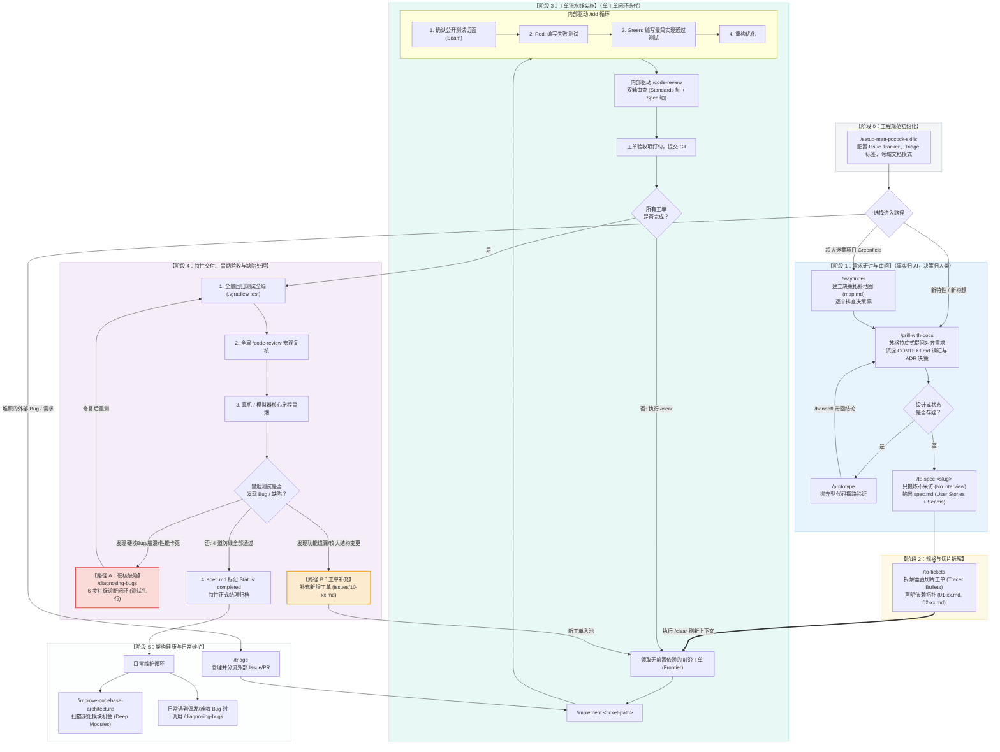

# Matt Pocock 工程技能规范（Engineering Workflow Guide）

> 本文档梳理了 Matt Pocock 技能体系的完整研发生命周期模型、各阶段 Skill 的调用方式、流程图、缺陷诊断（Bugfix）流转与工程最佳实践。供日常开发、新特性立项、冒烟测试及代码库维护查阅。

---

## 目录
- [一、生命周期全景流程图（Mermaid 图形版）](#一生命周期全景流程图mermaid-图形版)
- [二、生命周期全景流程图（纯文本/终端版）](#二生命周期全景流程图纯文本终端版)
- [三、核心生命周期阶段与 Skill 详解](#三核心生命周期阶段与-skill-详解)
  - [阶段 0：前置初始化（仅需一次）](#阶段-0前置初始化仅需一次)
  - [阶段 1：需求研讨与审问（Idea & Exploration）](#阶段-1需求研讨与审问idea--exploration)
  - [阶段 2：规格沉淀与切片拆解（Spec & Tickets）](#阶段-2规格沉淀与切片拆解spec--tickets)
  - [阶段 3：工单流水线实施（Implementation Loop）](#阶段-3工单流水线实施implementation-loop)
  - [阶段 4：特性交付、冒烟验收与缺陷处理（Feature Close-out & Defect Loop）](#阶段-4特性交付冒烟验收与缺陷处理feature-close-out--defect-loop)
  - [阶段 5：日常维护与代码库健康（Upkeep & Bugfix）](#阶段-5日常维护与代码库健康upkeep--bugfix)
- [四、缺陷诊断纪律（/diagnosing-bugs 6 步闭环法）](#四缺陷诊断纪律diagnosing-bugs-6-步闭环法)
- [五、上下文卫生法则（Context Hygiene）](#五上下文卫生法则context-hygiene)
- [六、Spec 验收与交付检查清单（Checklist）](#六spec-验收与交付检查清单checklist)

---

## 一、生命周期全景流程图（Mermaid 图形版）



---

## 二、生命周期全景流程图（纯文本/终端版）

```text
========================================================================================
【阶段 0：前置初始化】
  /setup-matt-pocock-skills  --> 配置 Issue Tracker (本地/GitHub)、Triage 标签与领域文档模式
========================================================================================
                                     │
      ┌──────────────────────────────┼──────────────────────────────┐
      │ 【切入口 1：新特性/新想法】   │ 【切入口 2：超大迷雾项目】     │ 【切入口 3：排队 Bug/外来需求】
      │                              │ (Greenfield / 庞大复杂项目)  │
      │                              ▼                              ▼
      │                         /wayfinder                      /triage
      │                     (建立拓扑决策地图，逐个击破)        (状态机流转、评估与筛选)
      │                              │                              │
      ▼                              ▼                              │
【阶段 1：需求研讨与审问】           └──────────────┐               │
  /grill-with-docs (或 /grill-me)                   │               │
  • 无情提问澄清边界，事实归 AI，决策归人类         │               │
  • 自动更新 CONTEXT.md 领域词汇与 ADR 决策         │               │
      │                                             │               │
      ├──────────────────┐                          │               │
      │ (有技术/UI不确定性)│                          │               │
      ▼                  ▼                          │               │
  /prototype          /handoff (跨上下文传递)        │               │
  (写抛弃型代码探路)     │                          │               │
      └──────────────────┘                          │               │
      │                                             │               │
      ▼                                             │               │
====================================================│===============│===================
【阶段 2：规格与切片拆分】                          ▼               │
  /to-spec  <───────────────────────────────────────┘               │
  • 只提炼不采访 (No interview, just synthesis)                     │
  • 产出带 User Stories 与 Testing Seams 的 spec.md                 │
      │                                                             │
      ▼                                                             │
  /to-tickets                                                       │
  • 将 Spec 切成垂直切片微工单（Tracer-bullet）                     │
  • 声明依赖拓扑（Blocked by），输出 01-xx.md, 02-xx.md             │
      │                                                             │
      │                                                             ▼
      ├─────────────────【刷新上下文：/clear】─────────────────────>│
      │                                                             │
====================================================================│===================
【阶段 3：工单流水线实施（单工单闭环）】                             │
      ▼                                                             │
  /implement <工单路径> <───────────────────────────────────────────┘
  (领取无前置依赖的 Frontier 工单)
      │
      ├─> 驱动 /tdd (内部循环)
      │     1. 确认测试切面 (Confirm Seams)
      │     2. Red (写失败测试) → Green (最简实现) → Refactor
      │
      ├─> 驱动 /code-review (内部审查)
      │     双轴审查：Standards 轴 (代码规范) + Spec 轴 (工单验收条件)
      │
      └─> 打勾工单验收项，Git Commit
      │
      ▼
  【执行 /clear】 ──> 流转到下一个被解锁的工单，直到所有工单完毕
========================================================================================
                                     │
                                     ▼
【阶段 4：特性交付、冒烟验收与缺陷处理】
  1. 全量回归测试全绿 (.\gradlew test)
  2. 全局 /code-review 宏观复核
  3. 真机 / 模拟器核心用户旅程冒烟测试
         │
         ├───【发现异常/缺陷】────────────────────────────────────────────┐
         │                                                                 │
         │   [分支 A：崩溃/卡死/音质异常/疑难 Bug]                           │
         │     --> /diagnosing-bugs                                        │
         │         (建立红灯反馈循环 -> 复现最小化 -> 探针插桩 -> 修复)    │
         │         --> 修复后回流至：1. 全量回归测试                       │
         │                                                                 │
         │   [分支 B：功能遗漏/较大结构调整]                               │
         │     --> 新增工单 issues/10-xxx.md                               │
         │         --> 回流至：阶段 3 (/implement 垂直切片开发)            │
         │                                                                 │
         └───【验收无误：4 道防线全部通过】                                │
                 │                                                         │
                 ▼                                                         │
          4. 将 spec.md 标记为 Status: completed                           │
===========================================================================│============
                                     │                                     │
                                     ▼                                     │
【阶段 5：架构体检与日常运维】 <───────────────────────────────────────────┘
  • /improve-codebase-architecture : 扫描深化模块机会 (Deep Modules)
  • /diagnosing-bugs               : 日常排查偶发/难啃的生产 Bug
========================================================================================
【底层通用语汇支撑（贯穿始终）】
  • /domain-modeling : 统一名词，消除一词多义，更新 CONTEXT.md
  • /codebase-design  : 模块深度（Depth）、切面（Seam）、适配器（Adapter）设计基准
========================================================================================
```

---

## 三、核心生命周期阶段与 Skill 详解

### 阶段 0：前置初始化（仅需一次）

| 技能命令 | 适用时机 | 核心行为与输出 |
| :--- | :--- | :--- |
| **`/setup-matt-pocock-skills`** | 新项目建立或首次接入规范时 | 交互式生成：<br>1. `docs/agents/issue-tracker.md`（工单存储配置）<br>2. `docs/agents/triage-labels.md`（状态标签映射）<br>3. `docs/agents/domain.md`（单/多上下文模式） |

---

### 阶段 1：需求研讨与审问（Idea & Exploration）

*核心原则：事实归 AI 调研，决策归人类拍板。绝不带着含糊不清的假设写代码。*

| 技能命令 | 适用时机 | 核心行为与输出 |
| :--- | :--- | :--- |
| **`/grill-with-docs <想法>`** | **主线首选**：在具备代码库的目录下细化新想法 | 开启苏格拉底式提问，穷追技术边界；自动将提炼的名词更新到 `CONTEXT.md`，将重大技术选型写入 `docs/adr/`。 |
| **`/grill-me <想法>`** | 独立于代码库的轻量讨论（纯脑暴） | 无状态版的需求审问，不写文件，纯粹用于推敲概念。 |
| **`/wayfinder`** | 迷雾重重的宏大需求或冷启动项目 | 当一两个问题无法在当前会话敲定时，建立一张带拓扑关系的决策地图（`map.md`），逐个排查决策票，直到迷雾散去合流至 `/to-spec`。 |
| **`/prototype`** | 状态流转或 UI 交互必须亲眼看到才确定 | 编写可运行但随时可丢弃的最小原型代码；通过 `/handoff` 将验证结论带回主讨论线程。 |

---

### 阶段 2：规格沉淀与切片拆解（Spec & Tickets）

*核心原则：只提炼不采访（No interview, just synthesis）。*

| 技能命令 | 适用时机 | 核心行为与输出 |
| :--- | :--- | :--- |
| **`/to-spec <feature-slug>`** | 需求研讨充分对齐之后 | 停止反问，忠实提炼共识。输出包含 `Problem Statement`、`Solution`、超长 `User Stories` 列表、`Implementation Decisions`、`Testing Seams` 和 `Out of Scope` 的 `.scratch/<slug>/spec.md`。 |
| **`/to-tickets`** | `spec.md` 生成完毕后 | 将 Spec 切割为多个**垂直切片（Tracer Bullets）**工单，每个工单贯穿 UI、业务、数据与测试；显式声明 `Blocked by` 依赖关系，生成 `issues/01-xx.md` 等。 |

> ⚠️ **关键节点操作**：`to-tickets` 执行完毕后，必须在终端输入 **`/clear`** 结束规划阶段，以干净的上下文迎接编码。

---

### 阶段 3：工单流水线实施（Implementation Loop）

*核心原则：单窗口串行流水线，严禁未解锁工单并发；每次做完必清上下文。*

| 技能命令 | 适用时机 | 核心行为与输出 |
| :--- | :--- | :--- |
| **`/implement <工单路径>`** | 领取当前无阻塞的 Frontier 工单 | **自动驱动以下全套动作：**<br>1. **驱动 `/tdd`**：先向人类确认公开测试切面（Seam），编写失败测试（Red），再写实现转绿灯（Green），最后重构；<br>2. **驱动 `/code-review`**：双轴自动审查代码质量与工单验收项；<br>3. 自动将工单验收项打勾 `- [x]`，标记为 `resolved` / `completed` 并完成 Git Commit。 |

> ⚠️ **关键节点操作**：每完成一个工单并提交后，立即输入 **`/clear`**，然后再执行下一个已解锁的工单。

---

### 阶段 4：特性交付、冒烟验收与缺陷处理（Feature Close-out & Defect Loop）

*核心原则：四道防线层层验证，缺陷严格按纪律排查，人类拥有最终结项权。*

#### 1. 四道防线验证流程
- **第 1 道防线（工单验收）**：检查所有子工单是否均已打勾并处于 `resolved` / `completed` 状态。
- **第 2 道防线（全局回归）**：运行全量单元测试（如 `.\gradlew.bat testDebugUnitTest`），确保无任何代码破坏与退化。
- **第 3 道防线（全量审查）**：运行 **`/code-review`** 对照原始 `spec.md`，重点复核是否存在漏做（Missing）或越界（Scope Creep）。
- **第 4 道防线（真机冒烟）**：打出 APK 安装到真机/模拟器，人工走通核心用户主旅程（Happy Path）。

#### 2. 验收期缺陷处理分流（Defect Handling）
如果在真机冒烟或回归测试中发现问题，**严禁拍脑袋盲目改代码**，按以下两种标准路径处理：

- **路径 A：疑难杂症 / 卡死 / 崩溃 / 解码错误（首选 `/diagnosing-bugs`）**：
  - 遇到无法立刻确定病因、性能暴跌（如 ANR、死循环刷新、特定音频不出声）等缺陷；
  - 触发命令：`/diagnosing-bugs <问题描述>`；
  - 严格执行下文第 4 节的 6 步闭环诊断法；
  - 修复后自动重跑全量回归测试与真机验证。
- **路径 B：功能遗漏 / 较大结构调整（补充工单流）**：
  - 如果发现某个功能模块完全漏写，不应强塞在当前调试中；
  - 在 `.scratch/<slug>/issues/` 下追加 `10-xxx.md` 工单，打上依赖关系；
  - 输入 `/clear`，按正常的 `/implement` 流程规范落地。

#### 3. 结项归档
当所有缺陷修复完毕、4 道防线全部通过后：
- 将 `.scratch/<feature-slug>/spec.md` 顶部的 `Status: ready-for-agent` 改为 **`Status: completed`**。

---

### 阶段 5：日常维护与代码库健康（Upkeep & Bugfix）

| 技能命令 | 适用时机 | 核心行为与输出 |
| :--- | :--- | :--- |
| **`/triage`** | 收集到了外部反馈或大量 Issue/PR | 状态机流转：`needs-triage` → `needs-info` → `ready-for-agent` / `ready-for-human` / `wontfix`。为 Agent 编写可独立执行的 Brief。 |
| **`/diagnosing-bugs`** | 线上日常运行中，遇到疑难崩溃或性能退化 | 不凭空猜测假设。通过构造一条必定红灯的测试指令锁定现场，最小化定位并提交回归测试。 |
| **`/improve-codebase-architecture`** | 闲暇时刻，对架构做日常体检 | 扫描代码库，识别“浅接口（Shallow interface）”和过度暴露的细节，挖掘“深模块（Deep module）”重构机会，提高后续 AI 协作效率。 |

---

## 四、缺陷诊断纪律（/diagnosing-bugs 6 步闭环法）

当调用 `/diagnosing-bugs` 时，智能体必须严格遵循以下 6 步法，跳过任何步骤都需要明确的工程理由：

```text
  Phase 1: 建立紧密反馈循环 (Build a feedback loop)
           【铁律：在能指出一条必定红灯报错的验证命令之前，严禁猜想假说！】
                        ↓
  Phase 2: 复现与最小化 (Reproduce + Minimise)
           【将诱发 Bug 的场景剔除无关干扰，裁剪到最小致病源】
                        ↓
  Phase 3: 提出可证伪假设 (Hypothesise)
           【列出 3~5 个按概率排序、带因果预测的可证伪假说】
                        ↓
  Phase 4: 针对性插桩排查 (Instrument)
           【单变量验证，打上 [DEBUG-xxxx] 标签日志或断点，严禁大面积漫灌日志】
                        ↓
  Phase 5: 测试先行与修复 (Fix + Regression Test)
           【先写红灯的回归测试用例，再编写最简代码修复转绿灯，全量测试自证正确】
                        ↓
  Phase 6: 现场清理与沉淀 (Cleanup)
           【移除所有调试插桩，将修复的真实原因记录在 Git Commit 历史中】
```

---

## 五、上下文卫生法则（Context Hygiene）

整个生命周期能够高产出、低返工的核心奥秘在于**对 LLM 上下文窗口的精准控制**：

```text
[不可打断连贯区]                     [完全隔离切片区]
/grill-with-docs                  /implement Issue 01  -->  /clear
      ↓                                  ↓
  /to-spec        ==== /clear ====>  /implement Issue 02  -->  /clear
      ↓                                  ↓
 /to-tickets                         /implement Issue 03  -->  /clear
(保持同一窗口，严防语义折损)          (每次重新加载独立工单，始终处于 Smart Zone)
```

1. **不可打断连贯区（保持单会话）**：
   - 从需求研讨（`/grill-with-docs`）→ 规格生成（`/to-spec`）→ 工单拆分（`/to-tickets`），必须在**同一个会话窗口**中完成。
   - 避免中途执行 `/compact` 或 `/clear`，确保所有背景假设无损注入到工单中。
2. **完全隔离切片区（每次做完必 `/clear`）**：
   - 拆解出的工单由 `to-tickets` 保证了自包含性。实现具体工单时，不需要前序讨论的历史噪音。
   - **完成工单提交后，立即输入 `/clear`**，让模型始终在最敏锐的“智能区（Smart Zone，通常是上下文前 150k token）”内写代码。

---

## 六、Spec 验收与交付检查清单（Checklist）

在将一个特性的 `spec.md` 标记为 `Status: completed` 之前，请逐一核对以下 5 项指标：

- [ ] **1. 工单全部勾选**：所有子工单（`issues/*.md`）中的验收项已全部勾选，状态均为 `resolved` 或 `completed`。
- [ ] **2. 回归测试全绿**：在终端运行全套测试命令（如 `.\gradlew.bat testDebugUnitTest`），确保通过率为 100%。
- [ ] **3. 双轴审查无阻断**：运行 `/code-review` 审查分支差异，确认无违反项目规范（Standards 轴），且完整满足 User Stories（Spec 轴）。
- [ ] **4. 真实环境冒烟通过**：打包并在设备上实测走通一次核心用户旅程。
- [ ] **5. 冒烟缺陷闭环**：若在第 4 步冒烟中发现 Bug，已通过 `/diagnosing-bugs` 修复并补充了回归测试，且重新验证通过。

---
*文档更新日期：2026-09-26*
